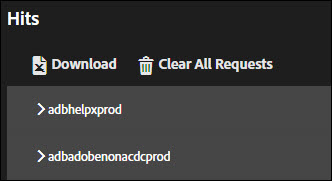
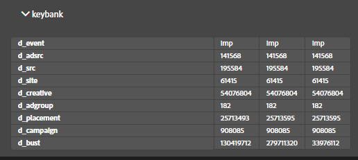

# Schede Soluzione {#solution-tabs}

Fai clic sulle schede Soluzione per visualizzare i risultati per specifiche soluzioni Adobe Experience Cloud.

## Analytics {#section-f71dfcc22bb44c86bec328491606a482}

La scheda Analytics fornisce informazioni sull’implementazione di [Analytics](https://docs.adobe.com/content/help/en/analytics/landing/home.html).

**Hit**

Per impostazione predefinita, tutte le chiamate server effettuate alla stessa suite di rapporti sono compresse.

**Scarica:** scarica informazioni su tutte le suite di rapporti visualizzate come foglio di calcolo Excel.

**Cancella tutte le richieste:** rimuovi tutte le richieste visualizzate dalla visualizzazione Analytics. Dopo aver cancellato le richieste, le nuove richieste verranno visualizzate quando si verificano.

Fai clic sull’ID suite di rapporti per espandere la visualizzazione:

In questa schermata vengono visualizzate tutte le richieste dall’apertura di Debugger o dall’eliminazione delle richieste. I parametri predefiniti vengono mappati automaticamente a nomi descrittivi. Le variabili [prop ed eVar](https://docs.adobe.com/content/help/en/analytics/implementation/vars/page-vars/evar.html) possono essere mappate ai tuoi nomi descrittivi personalizzati (ad esempio, “prop1” potrebbe essere visualizzato come “Tipo utente”) se eseguite l’autenticazione utilizzando la funzione “Collega Analytics” (vedi sotto). Le richieste vengono visualizzate in sequenza da sinistra a destra.

**Scarica:** salva tutte le richieste effettuate nella suite di rapporti come foglio di calcolo Excel.

**Richieste chiare:** rimuovi tutte le richieste effettuate a questa suite di rapporti. Le nuove richieste vengono visualizzate nel momento in cui si verificano.

**Account collegati (legacy)**

Fai clic su **[!UICONTROL Link Account]**, quindi immetti le informazioni richieste per collegare un account Analytics a Debugger.

>[!NOTE]
>
>Attualmente, questa funzione è supportata solo per le credenziali di accesso legacy degli utenti Analytics.

**Recupera hit post-elaborati**

Abilita l’opzione Recupera hit post-elaborati se vuoi visualizzare i valori sugli hit di Analytics dopo l’esecuzione delle regole di elaborazione. Affinché questa funzione funzioni, devi accedere ad Adobe Experience Cloud.

Quando questa opzione è attivata, alle richieste di Analytics viene aggiunto un parametro di debug. Gli hit continuano a essere elaborati come qualsiasi altro hit. Debugger interroga l’API di debug di Analytics per recuperare i valori delle regole di post-elaborazione per tutti gli hit con un ID hit originale. Gli hit post-elaborati hanno uno sfondo viola e sono visualizzati accanto all’hit originale.

Per la maggior parte delle implementazioni di Analytics, le informazioni sulle regole di post-elaborazione sono disponibili in pochi minuti. L’implementazione di Analytics per Target (A4T) richiede molto più tempo.

## Target {#section-988873ba5ede4317953193bd7ac5474c}

Utilizza la scheda Target per visualizzare i dettagli delle richieste di [Target](https://docs.adobe.com/content/help/en/target/using/target-home.html) o di [traccia di Mbox](https://docs.adobe.com/content/help/en/target/using/activities/troubleshoot-activities/content-trouble.html).

Fai clic su **[!UICONTROL Requests]**, quindi espandi l’ambiente per visualizzare le informazioni su Target.

Fai clic su **[!UICONTROL Clear All Requests]** per rimuovere le richieste attualmente visualizzate. Verranno visualizzate più richieste man mano che queste vengono effettuate.

Puoi inoltre utilizzare il filtro Target per [abilitare la traccia MBox a scopo di debug Target](https://docs.adobe.com/content/help/en/target/using/activities/troubleshoot-activities/content-trouble.html).

Per abilitare Mbox Trace, devi avere una scheda Chrome aperta autenticata in Experience Cloud. Una volta attivato, viene visualizzato il nome utente dell’Adobe ID. Espandi il tuo nome utente per esporre i codici client di Target associati alle organizzazioni Experience Cloud a cui hai accesso. Fai clic sul codice client per il quale desideri abilitare Mbox Trace e verifica che sia visualizzato il segno di spunta verde. Verranno visualizzate tutte le richieste Target con le informazioni di traccia Mbox, raggruppate per codice client. Per esplorare le informazioni di Mbox Trace, espandi la richiesta per visualizzare le schede:

* [Attività:](https://docs.adobe.com/content/help/en/target/using/activities/activities.html) la scheda Attività mostra tutte le attività associate al nome della richiesta Target, indipendentemente dal fatto che si sia qualificati per essa. Per “Attività abbinate” si intendono le attività per le quali hai qualificato e le cui offerte sono state distribuite nella risposta. Puoi espandere il nome dell’attività per confermare l’esperienza in uso e quali audience e condizioni di targeting ti hanno qualificato per l’attività. “Attività valutate” sono tutte le attività valutate, indipendentemente dal fatto che sei qualificato. Per risolvere i problemi relativi alla non qualificazione per un’attività “Valutata” ma non “Corrispondente”, espandi il nome dell’attività e controlla la sezione “Pubblico senza corrispondenza”.

* Richiesta

   La scheda della richiesta di [Mbox Trace](https://docs.adobe.com/content/help/en/target/using/activities/troubleshoot-activities/content-trouble.html) è simile alla scheda della richiesta principale. Puoi visualizzare tutti i parametri passati dalla richiesta Target, oltre alle intestazioni della richiesta.
* Profilo

   Espandi la sezione Profilo Snapshot per visualizzare le [informazioni di profilo](https://docs.adobe.com/content/help/en/target/using/audiences/visitor-profiles/variables-profiles-parameters-methods.html) memorizzate come visitatore nel database dei profili di Target. Tutti i profili in-mbox e script sono esposti qui, oltre ad alcuni di sistema. La colonna Stato mostra i profili modificati nell’ambito di questa richiesta, nonché i relativi valori prima e dopo l’ingresso della richiesta nel sistema del profilo.
* Audience Manager

   Le sezioni “segmentIds” e “cachedSegmentIds” della scheda Audience Manager mostrano gli ID delle [audience](https://docs.adobe.com/content/help/en/target/using/audiences/target.html) condivisi da Experience Cloud a Target e per i quali sei qualificato. Possono esserci audience create in Audience Manager, Analytics o nel generatore di pubblico nel servizio People Core. Questi ID possono essere cercati nell’interfaccia utente di Audience Manager per trovare il nome dell’audience.

Il seguente video mostra la funzionalità di Target generale:

>[!VIDEO](https://video.tv.adobe.com/v/23115t2/)

Il seguente video mostra la traccia Mbox:

>[!VIDEO](https://video.tv.adobe.com/v/23113t2/)

## Audience Manager {#section-1d4484f8b46f457f859ba88039a9a585}

Utilizza la scheda [Audience Manager](https://docs.adobe.com/content/help/en/audience-manager/user-guide/aam-home.html) per visualizzare i dettagli degli [eventi](https://docs.adobe.com/content/help/en/audience-manager/user-guide/api-and-sdk-code/dcs/dcs-event-calls/dcs-event-calls.html). Fai clic sull’organizzazione per espanderla e visualizzare le informazioni.

Fai clic su **[!UICONTROL Clear All Events]** per reimpostare le informazioni visualizzate. I nuovi eventi verranno visualizzati nel momento in cui si verificano.

**Sincronizzazione ID**

La sincronizzazione ID è il primo passo del processo di trasferimento dati in entrata e asincrono. In questo passaggio, Audience Manager e il fornitore confrontano e abbinano gli ID per i rispettivi visitatori del sito.

Per ulteriori informazioni, consulta [Sincronizzazione ID per trasferimenti dati in entrata](https://docs.adobe.com/content/help/en/audience-manager/user-guide/implementation-integration-guides/sending-audience-data/batch-data-transfer-process/id-sync-http.html) nella documentazione di Audience Manager.

## Advertising Cloud {#section-ee80a9c509f2462c89c1e5bd8d05d7c8}

Utilizza la scheda Advertising Cloud per visualizzare le richieste di Advertising Cloud.

Fai clic su **[!UICONTROL Requests]**, quindi espandi l’ambiente per visualizzare le informazioni su Advertising Cloud.

Fai clic su **[!UICONTROL Clear All Requests]** per rimuovere le richieste attualmente visualizzate. Verranno visualizzate più richieste man mano che queste vengono effettuate.

## Servizio Experience Cloud ID {#section-a96c32f8e63a4991abb296f6e8ea01cf}

Utilizza la scheda Servizio Experience Cloud ID per visualizzare le richieste del servizio [Experience Cloud ID](https://docs.adobe.com/content/help/en/id-service/using/home.html).

Fai clic su **[!UICONTROL Requests]**, quindi espandi l’ambiente per visualizzare informazioni sul servizio Experience Cloud ID.

Fai clic su **[!UICONTROL Clear All Requests]** per rimuovere le richieste attualmente visualizzate. Verranno visualizzate più richieste man mano che queste vengono effettuate.
