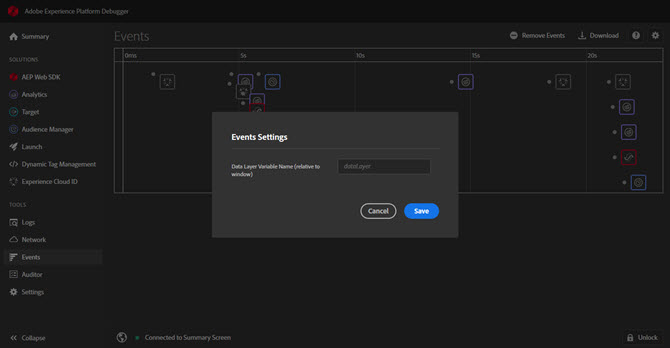

# Scheda Eventi

La **Eventi** La scheda fornisce una visualizzazione grafica degli eventi che si verificano, visualizzati su una timeline.

Per ogni evento, nella sequenza temporale viene visualizzata un’icona per la soluzione applicabile. Le icone mostrano anche le modifiche apportate al livello dati (se attivato). Passa il puntatore del mouse sopra un’icona per visualizzare un riepilogo dell’evento. Seleziona l’evento per ulteriori dettagli. Per visualizzare più eventi, puoi fare clic su Maiusc-Seleziona o Ctrl-Seleziona .

Seleziona un dettaglio per ulteriori informazioni.

## Rileva modifiche apportate al livello dati

Per abilitare il tracciamento delle modifiche al livello dei dati nella sequenza temporale:

1. Seleziona l’icona a forma di ingranaggio in alto a destra.
1. Inserisci il nome del livello dati.

   

1. Seleziona **[!UICONTROL Save]**.

I dettagli delle modifiche mostrano tutti gli elementi che sono stati eliminati o aggiunti al livello dati. È possibile selezionare **{}** per approfondire il livello dati.

## Scarica le informazioni sull’evento

Seleziona **[!UICONTROL Download]** per scaricare un file Excel con informazioni sulle chiamate effettuate da una pagina.
